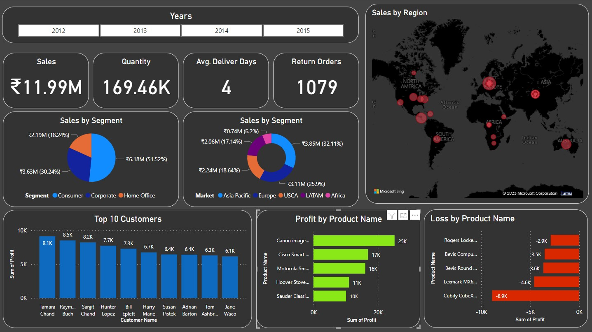

# Power--BI
Designing a Dashboard in Power Bi from the basic using the dataset of the Excel sheet. 

This Power BI template is used for loading a business data from the task table using excel datasheet. 
<h1 align="left">
  
</h1>

## Dependencies
 
  
|Software                                   |Dependency                 |
|:------------------------------------------|:--------------------------|
|[Power BI Desktop](https://powerbi.microsoft.com/en-us/downloads/)|Template|
|[Power BI Desktop](https://community.powerbi.com/t5/Themes-Gallery/University-of-Melbourne/td-p/163417)|Theme|
 

## Data/Telemetry

This project collects usage data and sends it to Microsoft to help improve our products and services. Read our [privacy statement](http://go.microsoft.com/fwlink/?LinkId=521839) to learn more.

### Disable telemetry collection within Power BI Desktop

Disable telemetry, within Power BI Desktop, do the following.

1. Select **File** > **Options and settings** > **Options**.

2. Within the **Options** dialog, select **Usage Data** and then uncheck **Help improve Power BI Desktop by sending usage information to Microsoft**.

3. Select **Ok**.
